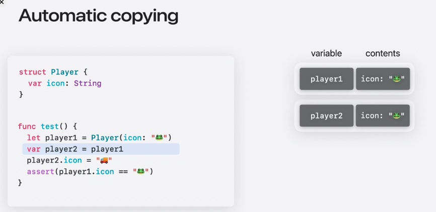
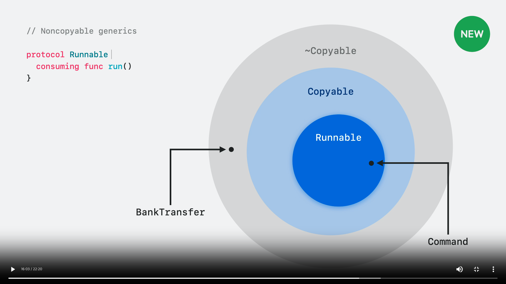
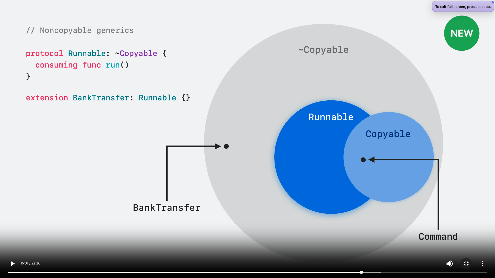
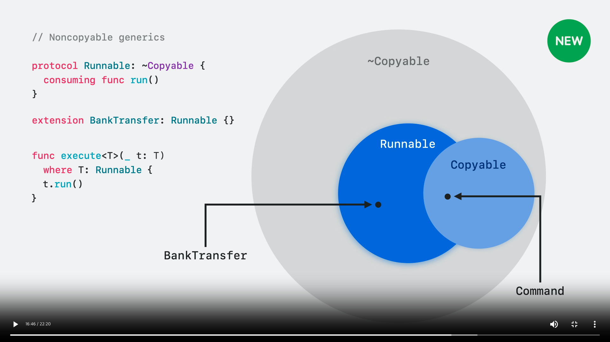
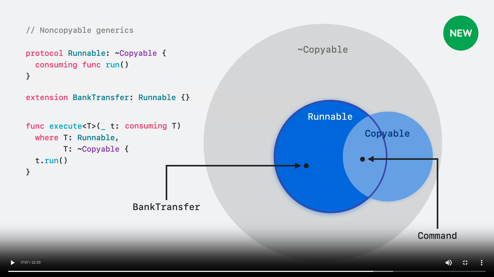

# 목차

- [깊은 복사와 얕은 복사](#깊은-복사와-얕은-복사)
  - [깊은 복사](#깊은-복사)
  - [얕은 복사](#얕은-복사)
  - [클래스의 깊은 복사](#클래스의-깊은-복사)
- [Copyable](#copyable)
  - [등장 배경](#등장-배경)
  - [Copyable이란](#copyable이란)
- [Non-Copyable (aka. Move-Only Type)](#non-copyable-aka-move-only-type)
  - [Non-Copyable 사용하기](#non-copyable-사용하기)
    - [소유권 (Ownership)](#소유권-ownership)
    - [1. consume](#1-consume)
    - [2. borrow](#2-borrow)
    - [3. inout (mutating)](#3-inout-mutating)
    - [NonCopyable의 deinit](#noncopyable의-deinit)
- [프로토콜과 제네릭 활용](#프로토콜과-제네릭-활용)
  - [조건부 Copyable](#조건부-copyable)
- [동시성과 관계](#동시성과-관계)
- [참고자료](#참고자료)

# 깊은 복사와 얕은 복사

Copyable에 대해 본격적으로 알아보기 전에, Swift에서의 Copy라는 행위에 대해 다시 한번 짚어보겠다.

## 깊은 복사



기본적으로 값타입인 struct, enum은 깊은 복사를 이용한다.

즉, 내부 데이터까지 값이 복사되된다는 뜻이다.

⇒ 독립적인 각자의 인스턴스 소유

## 얕은 복사


참조 타입인 class, actor에서 동작하는 방식이다.

즉, 값이 복사 될 때 참조값만 복사하고 가리키는 인스턴스는 동일하다는 의미이다.

ex) `let player2 = player1` 이라는 코드에서 player2는 player1의 참조만 갖게 되고 이 둘의 인스턴스는 공유된다.

## 클래스의 깊은 복사

대다수가 이미 알고있다싶이 값 타입을 복사하면 값 자체가 복사가 되고 참조 타입을 복사하면 참조가 복사된다.

하지만 이러한 참조 타입의 복사도 깊은 복사 방식을 사용하여 값 타입의 복사와 동일하게 동작하도록 구현 가능하다.

아래 코드와 같은 `Icon`과 `PlayerClass`가 있다고 해보자.

```swift
struct Icon {
  var icon: String
  init(_ icon: String) { self.icon = icon }
  init(from other: Icon) { self.icon = other.icon }
}

class PlayerClass {
  var data: Icon
  init(_ icon: String) { self.data = Icon(icon) }

  init(from other: PlayerClass) {
    self.data = Icon(from: other.data)
  } 
}
```


위 예제에서 메모리 관계를 보면, `var player2 = player1` 시점에서 `data.icon`의 **reference count가 2**인 것을 볼 수 있다.

이는 참조만 복사하고 같은 인스턴스를 가리키는 얕은 복사가 발생했음을 알 수 있다.


그러나 `PlayerClass` 객체를 복사하는 일이 발생할 때, 아래와 같이 `from` 매개변수가 있는 생성자를 사용하면 깊은 복사가 발생한다.

```swift
func test() {
  let player1 = PlayerClass("🐸")
  var player2 = player1
  player2 = PlayerClass(from: player2)
  player2.data.icon = "🚚"
  assert(player1.data.icon == "🐸")
}
```

실은 이 개념이 CoW(Copy on Write)의 핵심적인 개념이다. 그리고 위 과정을 통해 참조 타입의 복사도 값 타입과 동일하게 동작할 수 있게 된다.

<aside>
💡
CoW (= Copy on Write)

복사된 인스턴스가 데이터 수정을 하지 않은 경우 같은 메모리 공간을 보고 있다가 수정되었을 때 비로소 자신만의 메모리 공간을 할당 받는다.

</aside>

# Copyable

## 등장 배경

우리는 구조체, 열거형, 클래스 등의 형태로 사용자 정의 자료형을 나타낼 수 있다.

구조체와 열거형은 값타입을 나타낼 수 있는 자료형이고, 클래스는 참조타입을 나타낼 수 있는 자료형이다.

하나의 고유한 객체를 표현하고 싶으면 클래스를 사용하는 것이 일반적인 방법이다.

그러나, 클래스의 경우 다음의 단점이 존재한다.

- 힙 영역 메모리 관리 부담 (무한히 존재 가능)
- 참조 카운팅(Reference Counting)으로 인한 오버헤드 발생

경우에 따라서는 별로 부담이 안되는 비용일 수 있다.

그러나, 시스템적인 한계가 존재하거나 자주 사용되는 로직 등에서는 부담이 되는 것 또한 사실이다.

이런 점에서 착안하여 값타입에 대해 고유한 소유권(unique ownership)을 부여하는 방식이 요구되었다.

즉, 고유한 값타입을 만들어서 참조 타입의 특성 중 하나인 고유성을 대체하고자 하는 것이다.

## Copyable이란

값타입이 고유할 수 없는 이유가 무엇일까?

그것은 **값을 복사할 수 있기 때문**이다. 이는 여러곳에서 동시에 같은 인스턴스가 존재할 수 있는 가능성이 있다.

그렇다면 값을 복사할 수 없게 하면 어떨까?
값을 복사할 수 없게(`NonCopyable`) 할 수만 있다면, 값타입이라도 유일하게 존재할 수 있을 것같다.

여기서 등장한 개념이 `Copyable`이다.

`Copyable`은 (말 그대로) `복사가 될 수 있음`을 나타내는 프로토콜이다.

새로운 타입을 만들 때, 우리는 깊은 복사 가능 여부를 제어할 수 있다. 하지만 Swift가 자동으로 제공하는 복사에 대해서는 제어할 수 없다.

왜냐하면 일반적으로 이것을 채택한다고 명시할 필요 없이 자동으로 `Copyable`이 채택되기 때문이다.

암시적으로 `Copyable`을 준수하는 경우는 아래와 같다.

- 구조체(Struct) 선언, 복사할 수 없는(non-copyable) 저장 프로퍼티가 없는 경우 제외
- 열거형(Enum) 선언, 연관값이 복사할 수 없는 경우 제외
- 클래스(Class) 선언
- 액터(Actor) 선언
- 프로토콜(Protocol) 선언
- 연관타입(Associated Type) 선언
- 프로토콜 확장(Protocol-Extension)의 Self 타입
- 확장(Extension)에서는 확장되는 타입의 제네릭 매개변수

참조 타입인 클래스와 액터는 복사할 수 없는 저장 프로퍼티가 있어도 상관없다.
(스스로의 참조값은 복사 가능하므로)

# Non-Copyable (aka. Move-Only Type)

그런데 우리는 복사 가능한 값을 쓰고 싶은 것이 아니라 복사 불가능한 값이 궁금하다.

복사 불가능하다는 의미는 문자 그대로다.

이것은 `Copyable` 프로토콜을 준수하지 않도록 하면 달성할 수 있다.

간단히 `~Copyable`로 표현할 수 있다.
이를 `Copyable`을 자동으로 준수하지 않도록 `억누른다(suppress)`고 한다.

```swift
struct A: ~Copyable {
 //...
}
```

이렇게 하면 `Copyable` 채택을 억제할 수 있다.

- 이것은 어떤 특별한 프로토콜 제약사항을 추가하는 것이 아니다.

즉, 복사를 할 수 없게 한다.

## Non-Copyable 사용하기

고유한 값이 생겼지만, 복사를 할 수 없다는 단점이 생겼다.

프로그램에서 복사는 값을 전달하는 거의 유일한 방법이다.

함수에서의 사용, 대입 연산, 메소드 호출 등 생각보다 여러곳에서 값복사가 발생한다.

어떻게 사용해야할까?

### 소유권 (Ownership)

이에 대해 알아보기 위해서는 소유권이라는 개념에 대해 알아야 한다.

Swift에는 소유권(Ownership)이라는 기본 개념이 있다. 

**값의 소유권(Ownership of Value)** 이란 **값의 표현을 관리할 수 있는 책임**을 말한다.

값 혹은 property를 사용할 때에는 언제나 이 소유권 시스템과 상호작용하며 Swift의 메모리 안전의 핵심이 된다.

값은 아래 3가지로 사용될 수 있다.

- Consume it (소비될 수 있음)
: 소유권을 완전히 옮기는 것을 의미
- Mutate it (변경될 수 있음)
: 임시 쓰기 접근 권한을 제공을 의미
- Borrow it (빌려질 수 있음)
: 소유권을 빌려주는 것을 의미 (읽기 전용)

### consume, borrow, inout

새로운 연산자 comsume(소비), borrow(차용) 두개가 생겼다.

mutating(또는 inout)은 소비와 차용 둘 다 가능하지만 소비를 하면 새로운 값의 할당이 필요하다. 
(기본적으로 소유권 반환)

이전 연산을 통해 이후 가능한 연산을 정리하면 아래 표와 같다.

| 전→후 (행→열) | consume | borrow |
| --- | --- | --- |
| consume | ✅ | ✅ |
| borrow | ❌ | ✅ |
| inout (mutating) | ✅ (반환시 돌려줘야 함) | ✅ |

예시를 통해 자세히 알아보자.

### 1. consume


위의 코드가 있다고 하자.

매개변수 자료형 앞에 `consuming`이라는 예약어를 붙이면 **해당 파라미터를 호출자로부터 가져온다**는 의미가 된다.

그러나 `newDisk` 메소드에서는 문제가 발생한다.


newDisk 메소드에 있는 디스크 내용을 format 메소드 파라미터 disk에 넘겨주었기 때문이다.

이를 통해 한번 “소비”한 result라는 변수는 다시 사용될 수 없다.

사용자는 이를 컴파일 시간에 알게 되고 오류를 확인하여 처리해야 한다.

### 2. borrow


borrowing으로 등록된 변수는 **읽기 권한이 부여**된다. (= let 바인딩처럼)

실제로 대부분의 모든 매개변수와 메소드는 이처럼 동작한다.


그러나 차이점으로는 명시적 차용된 인수는 소비나 변경이 불가능하고, 복사만 할 수 있다는 점이다.

잠시 빌려온 disk를 새 변수에 복사할 수 없다는 의미가 된다.

### 3. inout (mutating)


format 메소드 내에서 쓰기 접근 권한이 있기에 매개변수를 소비할 수 있다.

단, **소비를 했다면** 함수가 종료되기 전 어느 시점에 inout 매개변수를 다시 초기화해야 한다.


왜냐하면, 매개변수로 들어온 disk에 대한 소유권을 반환해야 하는데, 소비가 되어서 없어졌기 때문이다.

disk변수에 값을 재할당함으로써 함수가 끝났을 때 (그 값이 이전값과 동일하지 않아도 됨) 돌려주어야 한다.

- 이는 struct의 mutating함수에서도 동일하게 작동한다.
    
    ```swift
    struct copyinging: ~Copyable {
      var num: Int
      
      mutating func change() {
        _ = self
        // ❌ Missing reinitialization of inout parameter 'self' after consume
      }
    }
    ```
    

### NonCopyable의 deinit

NonCopyable은 deinit을 구현할 수 있다.

왜냐하면, 고유의 값을 가질 수 있기 때문이다.

고유의 값을 가진다는 것은, 그 객체가 소멸하는 것을 추적할 수 있다는 것을 의미한다.

따라서 소멸 시기에 필요한 함수를 호출할 수 있다.


- `discard` 연산을 사용하면 deinit을 호출하지 않고 인스턴스를 없앤다.

# 프로토콜과 제네릭 활용


대부분의 모든 타입은 기본적으로 Copyable을 따른다.

위의 예제에서, Command 라는 구조체는 Copyable을 따르고, Runnable이라는 프로토콜 또한 Copyable을 따른다.

다만, 자동으로 적용되기에 따로 프로토콜 준수를 명시하지 않아도 된다.

이제 아래 코드를 살펴보자.

```swift
struct BankTransfer: ~Copyable {
  consuming func run() {
    // ...
  }
}
```

위의 코드에서 `BankTransfer`는 **`Copyable`을 채택하지 않는다**.

💡
`~Copyable`은 **NonCopyable을 채택한다는 의미가 아니다!**

Swift에서 `Copyable`을 자동으로 **채택하지 않도록 억누른다**는 것이다.


이상황을 위의 다이어그램으로 나타낼 수 있다.

~Copyable이 Copyable을 포함하는 것이 어색하다는 생각이 들 수도 있다.

그러나 문맥적으로는 ~Copyable은 단순히 Copyable을 채택하지 않은 것들이다.

따라서, Copyable을 준수한다는 것은 단순히 ~Copyable 상태에서 Copyable에 해당하는 요구사항을 더 충족시킨 것에 불과하다.

그러므로, ~Copyable은 더 넓은 범위를 포함하고 Copyable의 제약사항을 구현한 타입들은 Copyable이라는 상대적으로 좁은 범위에 포함된다.

말로만 하면 와닿지 않을 수 있다. 그림으로 더 살펴보자.



`Runnable`이라는 프로토콜을 만들었다고 하자.

기본적으로 `Copyable`을 준수하도록 설정된다.



만약, `~Copyable`이라고 하면 위와같이 표현할 수 있다.

왜냐하면, 말 뜻 자체가 `Copyable`제약이 없다라는 뜻이 되기 때문이다.

그러므로 `Copyable` 제약이 없는 `~Copyable` 또한 채택 가능하고 그보다 좁은 `Copyable` 제약을 구현한 타입들도 `Runnable`을채택할 수 있다.



위의 상태에서 `BankTransfer`가 `Runnable`을 채택하면, `Runnable` 제약을 따르면서 `Copyable`은 따르지 않으므로, 위 그림처럼 표현된다.



여기서 `execute`를 살펴보자, 타입 T의 제약조건을 `Runnable`하되, `Copyable`을 **채택하지 않아도 된다**고 했으므로 보라색으로 포함된 원에 해당하는 모든 타입이 활용할 수 있다.

반면, 이전 그림의 `execute`함수에서 T는 자동으로 `Copyable`제약을 따르므로 `Runnable`과 `Copyable`의 교집합에 해당하는 타입만 실행할 수 있다.

## 조건부 Copyable

NonCopyable로 구현된 다음과 같은 타입이 있다고 하자.

```swift
struct Job<Action: Runnable & ~Copyable>: ~Copyable {
  var action: Action?
}
```

```swift
func runEndlessly(_ job: consuming Job<Command>) {
  while true {
    let current = copy job // Job이 NonCopyable 취급을 받기에 카피 불가능
    current.action?.run()
  }
}
```

위의 함수를 실행하려고 하면 Job은 Copyable을 채택하지 않았으므로 copy라는 연산을 할 수 없다.

그런데 copy가 필요한 작업이라면 어떻게 해야할까?

```swift
extension Job: Copyable where Action: Copyable { }
```

구조체가 `Copyable`을 준수하려면 기본적으로 하위 속성도 `Copyable`을 준수해야 한다.

따라서 조건부로 하위 타입이 `Copyable`을 준수할 때 자신도 `Copyable`을 준수하도록 작성할 수 있다.


이를 위와 같이 다이어그램으로 표현할 수 있다.

# 동시성과 관계

Sendable은 동시성환경에서 서로다른 도메인으로 보낼 수 있음을 나타낸다.

이는 주로 데이터를 복사해서 해당 도메인에 격리함으로써(캡쳐) 달성한다.

그런데 NonCopyable의 경우 복사를 할 수 없는데 동시성 환경에서 어떻게 동작할까?

Sendable타입은 기본적으로 Copyable이다. (Copyable이라고 Sendable은 아님)

그러나 NonCopyable도 동시성에서 사용할 수 있도록 **예외적으로 Sendable을 허용**한다.

- 이때 NonCopyable 타입은 Sendable을 명시적으로 채택해야 한다.

```swift
struct Copying2: NCop, ~Copyable, Sendable {
  var num: Int
}
```

비동기 함수에서 사용할 떄에도 소유권에 대해 조절하면서 사용해야 한다.

만약 Task를 쓰면 캡쳐가 안된다.

```swift
let globalA = copyinging(num: 1)
func good() {
  let a = copyinging(num: 1)
  let b = a
  let c = globalA
  // ❌ Cannot consume noncopyable stored property 'globalA' that is global
//  let d = a
  var e = b
  e.num = 2
  e.num = 3
  
  Task {
    let f = e
    // ❌ Noncopyable 'e' cannot be consumed when captured by an escaping closure
    
  }
}
```

---

### 참고자료

https://green1229.tistory.com/526

https://developer.apple.com/videos/play/wwdc2024/10170

https://developer.apple.com/documentation/Swift/Copyable

https://developer.apple.com/videos/play/wwdc2024/10217

https://github.com/swiftlang/swift-evolution/blob/main/proposals/0432-noncopyable-switch.md

https://github.com/swiftlang/swift-evolution/blob/main/proposals/0427-noncopyable-generics.md

https://github.com/swiftlang/swift-evolution/blob/main/proposals/0390-noncopyable-structs-and-enums.md